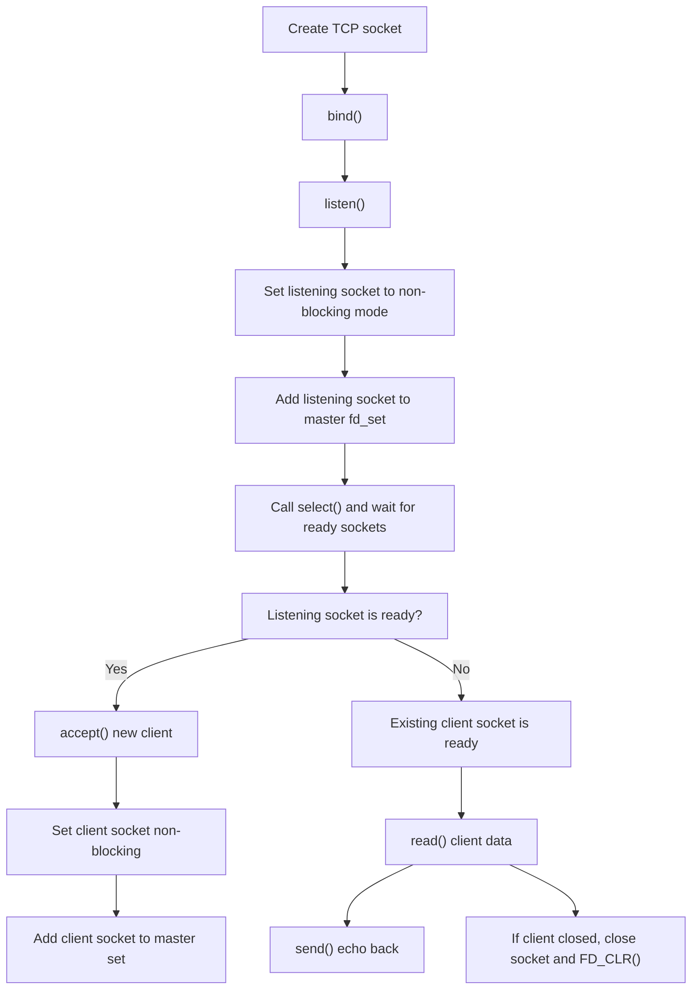

# Day 5 - Non-Blocking TCP Server with `select()`

Today I studied a much more practical server design: a TCP server that can handle multiple clients without blocking on a single socket. Instead of waiting forever inside one `accept()` or `read()` call, I used non-blocking sockets together with `select()` so the server can watch many file descriptors at the same time.

This felt like an important step because it moves me beyond the simple iterative server model. I am now starting to understand how one process can manage multiple client connections in an event-driven way.

---

## What I Studied Today

1. I learned how to put a socket into non-blocking mode using `fcntl()` and the `O_NONBLOCK` flag.
1. I studied why blocking calls can freeze the whole server when one client is slow or when no connection is ready.
1. I used `select()` to monitor the listening socket and all connected client sockets.
1. I learned how `fd_set`, `FD_ZERO()`, `FD_SET()`, and `FD_ISSET()` work together.
1. I practiced accepting new clients and adding them to the master file descriptor set.
1. I handled client disconnects by closing the socket and removing it from the set with `FD_CLR()`.
1. I built a simple echo-style server that reads data from a client and sends the same data back.

---

## Big Picture



This diagram helped me understand that the server is no longer focused on only one client at a time. Instead, it keeps looping over all active sockets and reacts only to the ones that are ready.

---

## Core Code Pattern

```c
readfds = master_set;

if (select(max_sd + 1, &readfds, NULL, NULL, NULL) < 0) {
    perror("Select error");
    exit(EXIT_FAILURE);
}

for (int i = 0; i <= max_sd; i++) {
    if (FD_ISSET(i, &readfds)) {
        if (i == master_socket) {
            handle_new_connection(master_socket, &master_set, &max_sd);
        } else {
            handle_client_data(i, &master_set);
        }
    }
}
```

This is the heart of the server. `select()` blocks until one or more sockets become ready. Then the loop checks which descriptors are active and decides whether that means a new connection or data from an existing client.

---

## What the Program Does

### 1. `setup_server()`

This function creates the listening socket, enables `SO_REUSEADDR`, binds to port `8080`, starts listening, and makes the socket non-blocking.

### 2. `set_nonblocking()`

This function uses:

```c
fcntl(fd, F_GETFL, 0);
fcntl(fd, F_SETFL, flags | O_NONBLOCK);
```

That means future operations on the socket should not wait forever. If no data is ready, the call returns immediately and the program can keep running.

### 3. `handle_new_connection()`

When `select()` reports that the listening socket is ready, the server calls `accept()`. If a client is actually waiting, the server:

- accepts the connection
- prints the client IP and port
- sets the new socket to non-blocking mode
- adds it to the master `fd_set`
- updates `max_sd` if needed

### 4. `handle_client_data()`

When an existing client socket becomes ready, the server:

- calls `read()`
- checks whether the client disconnected
- echoes the message back with `send()`
- removes dead sockets from the master set

This gives the server a simple multi-client echo behavior.

---

## Important Ideas

### Why non-blocking mode matters

In a blocking server, a single slow operation can stop progress for everything else. Non-blocking mode changes that behavior. If a socket is not ready, the kernel returns control to the program instead of forcing it to wait.

### Why `select()` matters

`select()` is a classic I/O multiplexing tool. It lets one process watch many file descriptors at once and react only when one becomes ready for reading, writing, or exceptional conditions.

### Why the server copies `master_set` into `readfds`

`select()` modifies the set you pass to it. That is why the code does:

```c
readfds = master_set;
```

The permanent list of all tracked sockets stays in `master_set`, while `readfds` is the temporary working copy used for one `select()` call.

### Why `EAGAIN` and `EWOULDBLOCK` are checked

When a socket is non-blocking, some operations may fail not because something is broken, but because the socket is simply not ready yet. These error codes mean "try again later", not "the program is wrong".

---

## What I Learned Today

1. A non-blocking socket returns immediately instead of waiting forever.
1. `fcntl()` can change socket behavior after the socket is created.
1. `select()` helps one process serve multiple clients by watching many descriptors.
1. The listening socket and client sockets can be handled in the same event loop.
1. `fd_set` is the structure that stores the descriptors being watched.
1. `FD_SET()` adds a descriptor, `FD_CLR()` removes it, and `FD_ISSET()` checks whether it is ready.
1. A server must close disconnected clients and clean them out of the descriptor set.
1. This server is more scalable than a simple one-client-at-a-time iterative server, even though it is still a basic design.

---

## Quick Memory Notes

- `socket()` creates the endpoint
- `bind()` gives it an address and port
- `listen()` makes it passive
- `accept()` creates a connected client socket
- `fcntl(... O_NONBLOCK)` prevents waiting forever
- `select()` tells me which sockets are ready
- `read()` gets data
- `send()` replies
- `close()` and `FD_CLR()` clean up disconnected clients

---

## Reflection

Today felt like a real upgrade in my networking understanding. Before this, I mostly thought about one socket and one client flow. Now I can see how a server can manage many clients using readiness-based logic instead of blocking on one operation. This is a strong step toward more advanced server models like `poll()`, `epoll`, threads, or process-based concurrency later.
