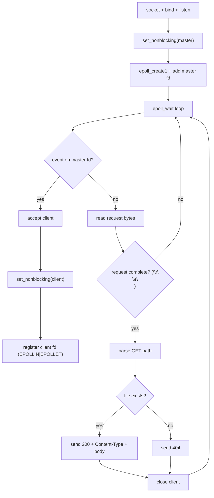

# Day 8 - `epoll` HTTP Server (Static Files)

> Focus mode: move from raw TCP echo flow to real HTTP request/response behavior.

---

## Snapshot

| Area | What I Built |
|---|---|
| Runtime model | Non-blocking sockets + `epoll` event loop |
| Protocol layer | Basic HTTP/1.1 request parsing |
| Methods | `GET` supported, others return `405` |
| File serving | Static files from `BASE_DIR` |
| Responses | `200`, `404`, and `405` paths |

---

## Architecture (One-View Map)



---

## What Changed Today

1. Added a lightweight client table to track per-connection read buffer state.
1. Built request completion detection using `\r\n\r\n`.
1. Implemented route-to-file mapping:
   - `/` -> `index.html`
   - `/name.ext` -> `BASE_DIR/name.ext`
1. Added content-type detection for common extensions (`html`, `css`, `js`, `png`, `jpg`, `json`, etc.).
1. Added graceful response branches:
   - `200 OK` for found files
   - `404 Not Found` for missing files
   - `405 Method Not Allowed` for non-`GET` methods

---

## Request Lifecycle (Mental Model)

```text
Client connects
 -> epoll signals readable fd
 -> server reads into client buffer (non-blocking)
 -> when headers end (\r\n\r\n), parse request line
 -> map URL path to filesystem path
 -> emit HTTP response (status + headers + optional body)
 -> close client socket
```

---

## Key Technical Notes

- `EPOLLET` (edge-triggered) needs careful read loops; read until `EAGAIN/EWOULDBLOCK`.
- Each client keeps its own buffer so partial reads can be assembled safely.
- `Connection: close` keeps response logic simple while learning protocol basics.
- Correct `Content-Length` is critical for browser/client correctness.

---

## Quick Test Commands

```bash
# Build
gcc -O2 -Wall -Wextra -o http_server http_server.c

# Run
./http_server

# Test root file
curl -i http://127.0.0.1:8080/

# Test missing file (expect 404)
curl -i http://127.0.0.1:8080/not-found.html

# Test unsupported method (expect 405)
curl -i -X POST http://127.0.0.1:8080/
```

---

## Reflection

Today was a big transition point.  
I combined low-level socket/event handling with protocol-level thinking (HTTP framing, headers, and file-based responses). This is the first version that feels like a "real server," not only a networking demo.

---

## Next Step

- Support persistent connections (`keep-alive`) and safer path handling.
- Stream large files in chunks (instead of loading full file into memory).
- Add basic logging format (`method`, `path`, `status`, `bytes`, `client_ip`).

